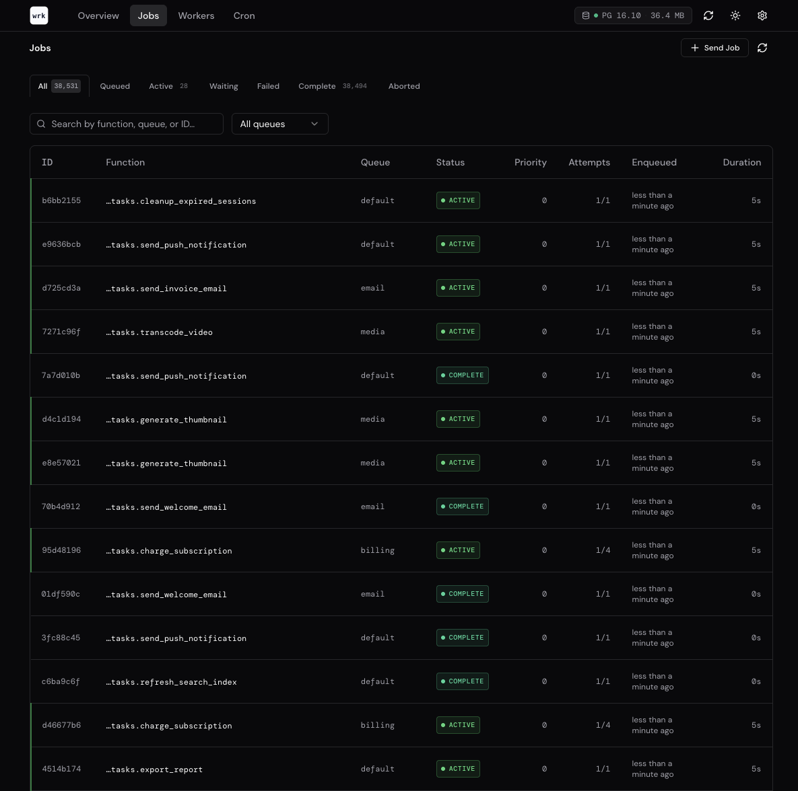
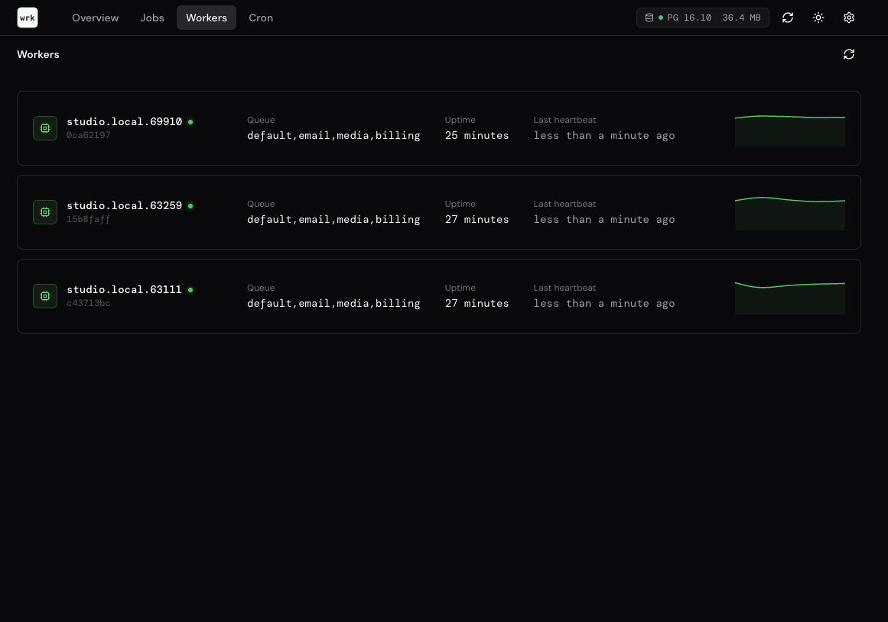
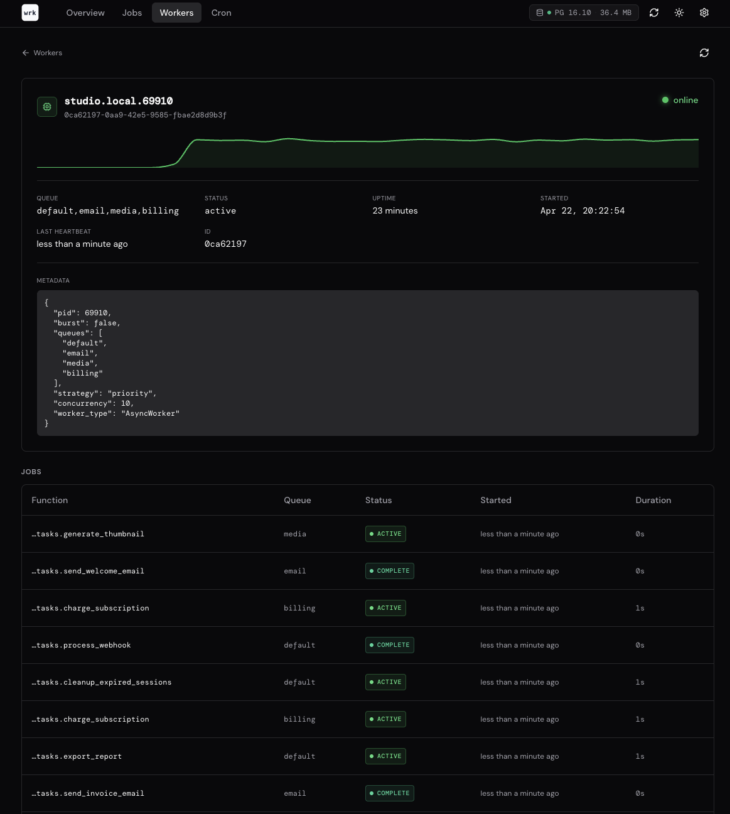
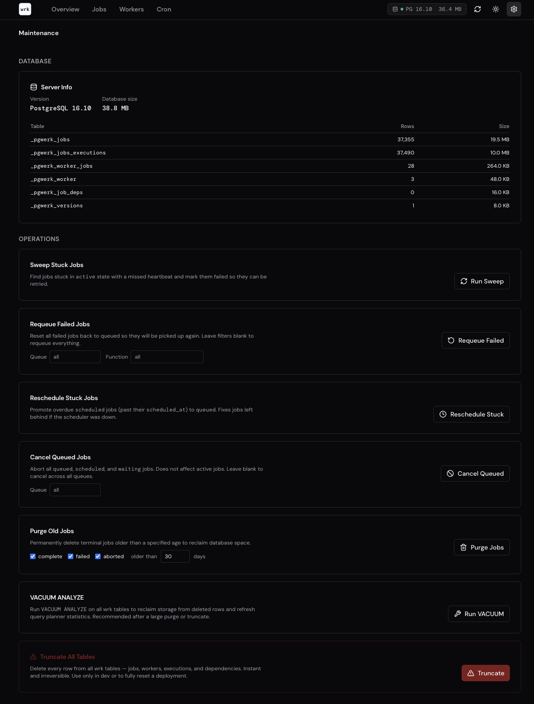

# Dashboard

`werk` ships with an optional terminal dashboard that shows live queue depths, throughput, and worker activity.

## Screenshots

### Overview


### Jobs



### Workers



### Worker details



### Maintenance



## Install

The dashboard requires the `analytics` optional extra:

```bash
pip install "wrk[analytics]"
```

This installs `rich` and `plotext` as additional dependencies.

## Start

Pass your `Wrk` instance using the standard `module:attribute` format:

```bash
wrk dashboard myapp.tasks:app
```

## What it shows

The dashboard refreshes automatically and displays:

- **Queue depth** — pending job counts per queue
- **Active workers** — registered worker instances, their queues, and heartbeat status
- **Throughput chart** — completed jobs over the last N minutes
- **Queue depth history** — how queue depth has changed over time
- **Server info** — Postgres version, connection pool stats, table prefix

## REST API

For programmatic access to queue and worker metrics, the optional REST API provides JSON endpoints:

```bash
pip install "wrk[api]"
wrk api myapp.tasks:app
```

The API is built with [Litestar](https://litestar.dev) and exposes endpoints for listing jobs, queue statistics, worker status, and job management (cancel, requeue, purge).
